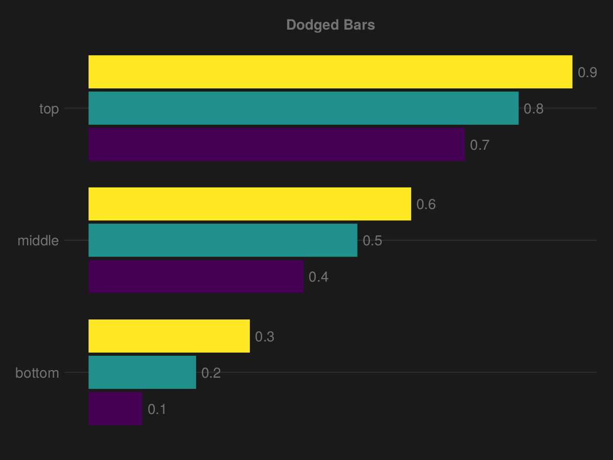

# TidierPlots.jl

[](https://github.com/TidierOrg/Tidier.jl/blob/main/LICENSE)
[](https://tidierorg.github.io/TidierPlots.jl/latest)
[](https://pkgs.genieframework.com?packages=TidierPlots)


## What is TidierPlots.jl?
TidierPlots.jl is a 100% Julia implementation of the R package ggplot in Julia. Powered by AlgebraOfGraphics.jl, Makie.jl, and Julia’s extensive meta-programming capabilities, TidierPlots.jl is an R user’s love letter to data visualization in Julia.

`TidierPlots.jl` has three goals, which differentiate it from other plotting packages in Julia:

1.  **Stick as closely to tidyverse syntax and behaviour as possible:** Whereas other
    meta-packages introduce Julia-centric idioms for working with
    plots, this package’s goal is to reimplement ggplot
    in Julia. This currently just means that `TidierPlots.jl` gives the option for specifying `aes` with the macro `@es` to allow unquoted column references, but the use of macros may need to expand as more features are added. 

2.  **Stay as compatible as possible with Makie.jl** This package is meant
    to be a thin wrapper around Makie's SpecApi syntax to help introduce R users to plotting in 
    Julia. 

3. **To Extend ggplot using julia-specific features where appropriate** as long as this does
    not confict with the first two goals. The package aims to behave exactly like ggplot
    unless told otherwise. Additional options and parameters that are not present in ggplot 
    may be added, but options that are present in R's ggplot should behave the way they do in R. 

## Installation

For the "stable" version, access the Pkg interface by pressing `]` at the `julia>` prompt, then type `add TidierPlots`. 

For the development version:

```julia
using Pkg
Pkg.add(url="https://github.com/TidierOrg/TidierPlots.jl")
```

## What functions does TidierPlots.jl support?

TidierPlots.jl currently supports the top-level function `ggplot()`, plus:

Geoms:

- `geom_point`
- `geom_errorbar`
- `geom_path`, `geom_line`, and `geom_step`
- `geom_bar`, `geom_col`, and `geom_histogram`
- `geom_boxplot` and `geom_violin`
- `geom_contour` and `geom_tile`
- `geom_density`
- `geom_text` and `geom_label`

Makie Themes:

- `theme_ggplot2()` (the default)
- `theme_dark()`
- `theme_black()`
- `theme_light()`
- `theme_minimal()`

Colour Scales:

- `scale_colo[u]r_manual()` - give a list of hex `values` enclosed in `c()` to define a scale
- `scale_colo[u]r_[discrete|continuous]()` - set `palette =` a [Makie palette]( https://docs.makie.org/stable/explanations/colors/index.html#colormaps). 

Additional Elements:

- `scale_[x|y]_[continuous|log[ |2|10]|logit|pseudolog10|sqrt|reverse]`
- `labs`
- `lims`

## Display Options for Quarto, Jupyter, and Pluto.jl

Use the function `TidierPlots_set(option::String, value::Bool)` to control display options. The following options are supported:

- "plot_show" (default true). Enables `ggplot`-like behaviour where plots are displayed when created.
- "plot_log" (default true). Prints a text summary of the properties of the ggplot

You will likely want to disable both of these if you are working in a notebook environment. In [Pluto.jl](https://github.com/fonsp/Pluto.jl), you can get interactive plots (scroll, zoom, labels, etc.) using `WGLMakie` by including `WGLMakie.activate!()` as the first cell after your imports. 

## Differences from ggplot2

The goal of this package is to allow you to write code that is as similar to ggplot2 code as possible. The only difference in basic usage is in the `aes()` function. TidierPlots.jl accepts two forms for aes specification, neither of which is *exactly* the same as ggplot2.

- Option 1: `aes` function, julia-style columns, e.g. `aes(x = :x, y = :y)` or `aes(:x, :y)`
- Option 2: `@aes` (or `@es`) macro, aes as in ggplot, e.g. `@aes(x = x, y = y)` or `@aes(x, y)`
- Option 3 (Deprecated): `aes` function, column names as strings, e.g. `aes(x = "x", y = "y")` or `aes("x", "y")`

If you use Option 1, you get experimental support for calculations inside aes, including `+`, `-`, `*`, `/` and function application. Functions can be applied to columns with the `>>` operator, or wrapped for aes use with the `aesthetics_function()` command. The following geom_point specifications are equivalent: 

```
my_fn(x) = x ./ 10
my_aes_fn = aesthetics_function(my_fn)

geom_point(aes(x = :x/10))
geom_point(aes(x = :x >> my_fn))
geom_point(aes(x = my_aes_fn(:x)))
```

Functions can take multiple columns as input (up to two, currently). The following `geom_point` specifications are equivalent, and result in `x / y` being plotted as the x axis of the graph: 

```
my_new_fn(x, y) = x ./ y
my_new_aes_fn = aesthetics_function(my_new_fn)

geom_point(aes(x = :x/:y))
geom_point(aes(x = my_aes_fn(:x, :y)))
```

## Why would I use this instead of ggplot2? 

**Right now, you probably wouldn't.** This package is still early in development, and is not ready for production use. However, there are a couple of advantages already and the list will hopefully get longer over time. 

### Easier Factor Handling

Sort your categorical variables in order of appearance with a single keyword rather than wrestle with factor ordering!

```
@chain cars begin
    @count(manufacturer)
    @arrange(n)
    ggplot(xticklabelrotation = .5)
        geom_col(aes(y = :n, x = cat_inorder(:manufacturer)))
end
```


### Simple Bar Labels

Access to all axis and plot options from `Makie` let you take advantage of nice features like easy `bar_labels`: 

```
df = DataFrame(
    cat = ["left", "left", "left",
           "middle", "middle", "middle",
           "right", "right", "right"],
    height = 0.1:0.1:0.9,
    grp = [1, 2, 3, 1, 2, 3, 1, 2, 3]
)

ggplot(df, yticks = (1:3, ["bottom", "middle", "top"])) + 
    geom_col(@aes(cat, height, color = grp, bar_labels = height), 
        position = "dodge", direction = "x") + labs(title = "Dodged Bars") + theme_dark()
```


See the [documentation](https://tidierorg.github.io/TidierPlots.jl/latest) for more information and examples. 

# What's New

See [NEWS.md](https://github.com/TidierOrg/TidierPlots.jl/blob/main/NEWS.md) for the latest updates.

# What's Missing

Lots! Please feel free to file an issue and/or submit a pull request to add additional ggplot-based features. If it is in ggplot, we want to add it. 

