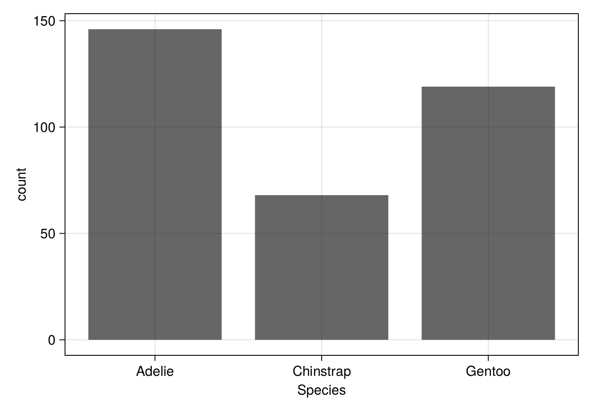

</img>

## What is TidierPlots.jl?
TidierPlots.jl is a 100% Julia implementation of the R package ggplot in Julia. Powered by the AlgebraOfGraphics.jl, Makie.jl, and Julia’s extensive meta-programming capabilities, TidierPlots.jl is an R user’s love
letter to data visualization in Julia.

`TidierPlots.jl` has three goals, which differentiate it from other plotting packages in Julia:

1.  **Stick as closely to tidyverse syntax and behaviour as possible:** Whereas other
    meta-packages introduce Julia-centric idioms for working with
    plots, this package’s goal is to reimplement ggplot
    in Julia. This means that `TidierPlots.jl` uses *tidy expressions* as opposed
    to idiomatic Julia expressions. An example of a tidy expression is
    `a = mean(b)`.

2.  **Stay as compatible as possible with AlgebraOfGraphics.jl** This package is meant
    to be a thin wrapper around AoG's syntax to help introduce R users to plotting in 
    Julia. `Geom` objects declared in TidierPlots.jl can be easily converted to AoG `Layer`
    objects using `Layer(Geom)`, and `GGPlot` objects can be converted to AoG `Layers` objects using `Layers(GGPlot)`.

3. **To Extend ggplot using julia-specific features where appropriate** as long as this does
    not confict with the first two goals. The package aims to behave exactly like ggplot
    unless told otherwise. Additional options and parameters that are not present in ggplot 
    may be added, but options that are present in R's ggplot should behave the way they do in R. 

    ## What functions does TidierPlots.jl support?

To support R-style programming, TidierPlots.jl is implemented using macros.

TidierPlots.jl currently supports the top-level macro `@ggplot()`, plus:

Geoms:

- `geom_point`
- `geom_smooth`
- `geom_errorbar`
- `geom_path`, `geom_line`, and `geom_step`
- `geom_bar`, `geom_col`, and `geom_histogram`
- `geom_boxplot` and `geom_violin`
- `geom_contour` and `geom_tile`
- `geom_text` and `geom_label`

Makie Themes:

- `theme_ggplot2()` (the default)
- `theme_dark()`
- `theme_black()`
- `theme_white()`
- `theme_minimal()`

Additional Elements:

- `scale_[x|y]_[continuous|log[ |2|10]|logit|pseudolog10|sqrt|reverse]`
- `labs`
- `lims`

## Example

Let's make some plots using the Palmer Penguins data from `PalmerPenguins.jl`:

```julia
using TidierPlots
using DataFrames
using PalmerPenguins

penguins = dropmissing(DataFrame(PalmerPenguins.load()))

@ggplot(data = penguins) + 
    @geom_bar(aes(x = species)) +
    @labs(x = "Species")
```
